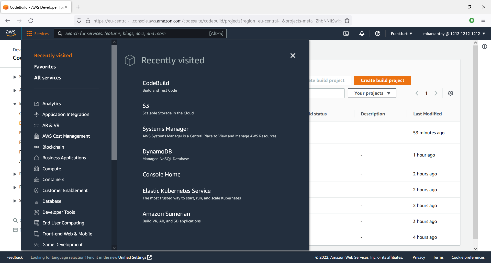
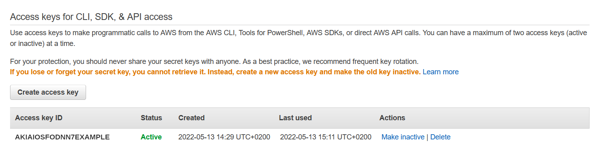
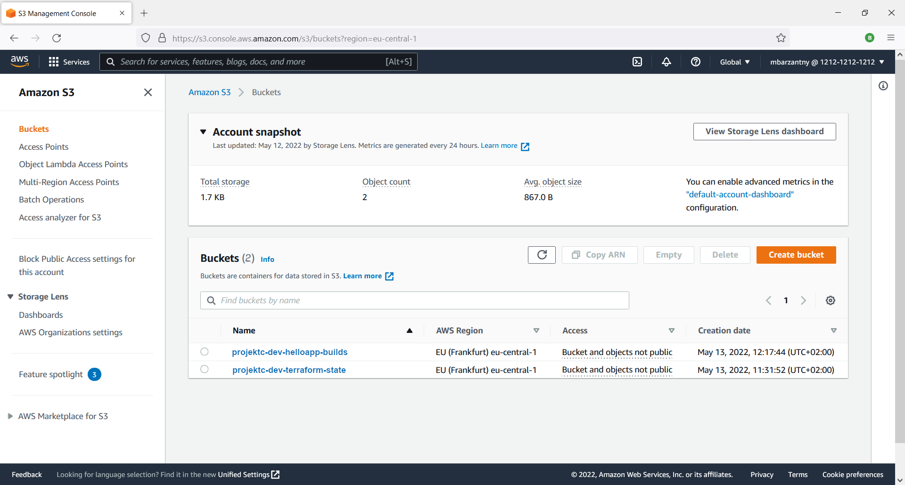
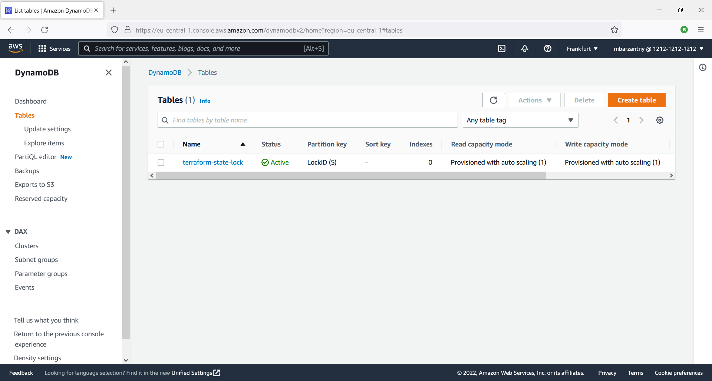
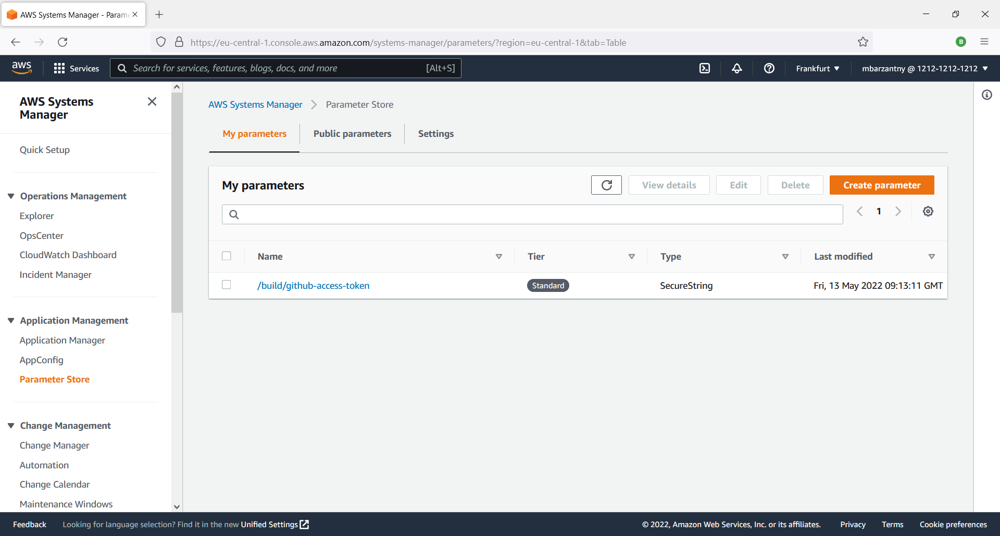
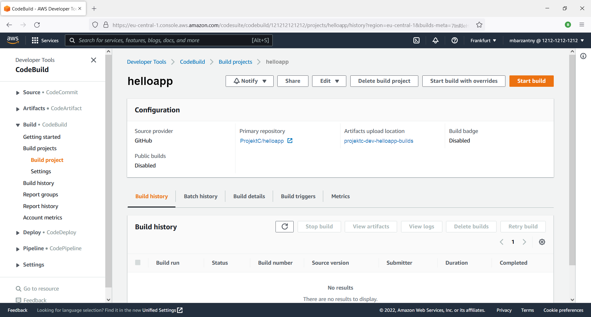

# AWS CodeBuild
- [fpm](https://github.com/mbHAW/ProjektC/blob/doc/fpm.md)
- [awscli](https://github.com/mbHAW/ProjektC/blob/doc/awscli.md)
- [terraform](https://github.com/mbHAW/ProjektC/blob/doc/terraform.md)
- [buildspec.yml](https://github.com/mbHAW/ProjektC/blob/doc/buildspec.md)

## Was ist AWS CodeBuild?
Die [Homepage](https://docs.aws.amazon.com/de_de/codebuild/latest/userguide/welcome.html) hat dazu Folgendes zu sagen:
"AWS CodeBuild ist ein vollständig verwalteter Build-Service in der Cloud. CodeBuild kompiliert den Quellcode, führt Einheitentests aus und erzeugt Artefakte, die bereitgestellt werden können. Dank CodeBuild brauchen Sie keine eigenen Build-Server mehr bereitzustellen, zu verwalten und zu skalieren. Es bietet vorgefertigte Build-Umgebungen für gängige Programmiersprachen und Build-Tools wie Apache Maven, Gradle und mehr. Sie können außerdem die Build-Umgebungen in CodeBuild anpassen, um eigene Build-Tools zu erstellen. CodeBuild wird automatisch skaliert, um Build-Anforderungsspitzen abzufangen."

Das Konzept ist dabei, dass man als Entwickler nur noch einen einmaligen Aufwand bei dem Aufsetzen von CodeBuild auf AWS hat und anschließend nur noch als Observierende Instanz den Prozess kontrolliert.
Aktualisierungen, Skalierungen, Sicherheits-Snapshots, Logging und andere zeitraubende Aufgaben werden von AWS übernommen, was dem Entwickler mehr Freiraum für neue Projekte gibt. Unter Umständen könnte dadurch sogar die Anzahl an zuständigen Mitarbeitern in einem Unternehmen reduziert werden.


Die Projektdateien, die in einem Github-Repository oder auch auf AWS selber liegen können, werden von CodeBuild geholt und gemäß der Einstellungen bearbeitet und kompiliert. Anschließend werden die fertigen Projektdateien in einem S3-Bucket (das ist in gewisser Weise einfach ein Cloudspeicher) gesichert und stehen dann z.B. zum Download bereit.

AWS stellt außerdem auch noch einen Service, Namens [CodePipeline](https://docs.aws.amazon.com/de_de/codebuild/latest/userguide/how-to-create-pipeline.html) zur Verfügung, der dafür vorgesehen ist, zusammen mit CodeBuild verwendet zu werden um ein noch höheres Maß an Automatisierung zu erreichen. Für dieses Projekt ist CodeBuild für sich allein aber vollkommen ausreichend, weshalb CodePipeline hier nur am Rande erwähnt werden soll.

**Ein neues Build-Projekt anlegen:**  
Es gibt, wie überall auf AWS, gleich [mehrere](https://docs.aws.amazon.com/de_de/codebuild/latest/userguide/create-project.html) Möglichkeiten, ein neues Projekt anzulegen.  
Will man CodeBuild direkt auf AWS anlegen und konfigurieren, dann empfiehlt sich der Weg über die AWS CodeBuild-Konsole.  
Möchte man statt dessen auf externe Hilfstools, wie z.B. Terraform zurückgreifen, so bietet sich der AWS CLI (Terminaltool) an.  
Die Verwendung von [Terraform](https://registry.terraform.io/providers/hashicorp/aws/latest/docs/resources/codebuild_project) für die Generierung von AWS-Projekten über die eigene Terminal-Umgebung ermöglicht es außerdem, dass man das selbe Projekt nicht nur für Amazon AWS, sondern z.B. gleichzeitig auch für Microsoft Azure erstellen kann, sollte man z.B. das selbe Produkt für unterschiedliche Kunden bereitstellen wollen oder weil es aus Redundanzgründen wichtig ist, dass das Produkt oder der Service von unterschiedlichen Providern her angeboten werden kann. AWS-Ausfälle zwar sind nicht die Regel,  aber trotzdem auch nicht ausgeschlossen.

In diesem Fall bedienen wir uns der Hilfe von Terraform für das AWS-Projekt und Docker für den lokal durchgeführten Test.

Es ist vorteilhaft, dass man den Prozess, den man später nach AWS verschieben möchte, vorher schon einmal auf dem eigenen Rechner auf Funktionalität testen kann.
Das Einzige, was Codebuild dafür benötigt, ist lediglich der Projektordner mit den Source-Dateien und eine Konfigurationsdatei mit der Bezeichnung "buildspec.yml", welche "CodeBuild" den Arbeitsablauf mitteilt.
Das Projekt für den lokalen Build-Test ist zu finden im Branch [lokal](https://github.com/mbHAW/ProjektC/tree/lokal).


## buildspec.yml
In dieser Konfugurationsdatei wird der gesamte Ablauf der Build-Prozesses definiert. Dabei ist es nicht zwingend notwendig, jeden Schritt genauso, wie hier zu befolgen.
Beispielsweise könnte man auch den Abschnitt `install:` weglassen und die Kommandozeilen unter `pre_build:` hinzufügen. (Manchmal tut es aber der Übersichtlichkeit gut, wenn die Prozesse in klare Abschnitte unterteilt werden.)
Bei jedem Build wird zuerst die aktuellste, oder in diesem Fall die Version 1.13 der gewünschten Programmiersprache installiert.
Der Abschnitt `build:` enthälten die Codezeilen, die für dei Kompilierung notwendig sind. `makefpm` ist dabei ein Shellscript, welches das Terminalprogramm `fpm` gleich mehrfach aufruft, da nämlich zwei Versionen des Programms `helloapp` erstellt werden sollen.
Im Abschnitt `artifacts` werden die fertigen Dateien angegeben, die im Anschluss auf den Build-Prozess auf dem PC (oder später im S3-Bucket) gespeichert werden sollen.
Gerade am Anfang erleichtert es möglicherweise den Testvorgang, wenn man die rohe Binärdatei `helloapp` mit ausgibt, weil man sich nach jeder Neu-Kompilierung so den Installationsschritt als Entwickler sparen kann.
Die zwei anderen Dateien sind die fertigen Installationspakete, die zusätzliche Instruktionen für das jeweilige Betriebssystem enthalten.
```yaml
version: 0.2

phases:
  install: 
    runtime-versions:
      golang: 1.13
    commands:
      - go get -u golang.org/x/lint/golint
      - yum -y install squashfs-tools
      - gem install fpm

  pre_build: 
    commands:
      - golint -set_exit_status
      - go test

  build:
    commands:
      - echo Build started on `date`
      - go build -o helloapp
      - ./makefpm

  post_build:
    commands:
      - echo Build completed on `date`

artifacts:
  files:
    - helloapp
    - ./helloapp-latest-amd64.rpm
    - ./helloapp-latest-amd64.deb
  discard-paths: yes
```

Die Konfigurationsdatei buildspec.yml ist eine sog. YAML-Datei was bedeutet, dass ganz besonders auf die richtige Einrückung geachtet werden muss.
Optimalerweise verwendet man für diesen Zweck einfach einen der online verfügbaren [YAML Validatoren](https://codebeautify.org/yaml-validator/).

Für weitere Beispiele, gehe zu [buildspec.yml](https://github.com/mbHAW/ProjektC/blob/doc/buildspec.md).  
Benutzt man Codebuild lokal zusammen mit dem Docker-Container, dann erstellt dieser nach jedem Build-Job eine Zipdatei, in die er alle Programmdateien tut.
Will man lokal gerne das Endprodukt in einzelne Dateien getrennt erhalten, so bietet es sich an, dass man [secondary-artifacts](https://docs.aws.amazon.com/codebuild/latest/userguide/sample-multi-in-out.html) definiert. Diese werden standardmäßig zwar ebenfalls gezippt, aber dafür befinden sich nicht alle Endprodukte in einer großen Zipdatei, was bei großen Dateien unter Umständen von Vorteil ist.


## Für das Deployment auf dem Remote-Server ist außerdem der Ordner "terraform-build" mit den Terraform-Dateien nötig.

Rein Theoretisch könnte man alle Einstellungen und Variablen in nur einer einzigen Terraformdatei unterbringen. Allerdings würde das die Lesbarkeit erheblich erschweren,
weshalb man in fast allen Projekten die Unterteilung in kleinere Dateien beobachten wird. Terraform ist es darüber hinaus egal, wie die Dateien benannt werden,
da es einfach alle Dateien mit der Endung .tf einliest und ausführt, als handelte es sich nur um eine einzige Konfigurationsdatei.
Dass jeder Programmierer seine eigenen Vorlieben hat, kann einem Beginner natürlich den Einstieg erschweren, da ihm nicht sofort ersichtlich ist,
dass tatsächlich nur der Inhalt der Datei zählt und es darüber hinaus gar kein festes System gibt. Lediglich speziell als lokale Variablen deklirierte Werte werden nur von Codezeilen der selben Datei erkannt.

#### Ordnerstruktur des vollständigen Projekts:
```sh
ProjektC/
├── buildspec.yml
├── config.json
├── helloapp.service
├── main.go
├── makefpm
├── post-remove.sh
├── pre-install.sh
└── terraform-build
    ├── codebuild.tf
    ├── iam.tf
    ├── main.tf
    ├── s3.tf
    ├── vars.tf
    └── .gitignore
```

___
**Springe zum Abschnitt:**
- [codebuild.tf](#codebuildtf)
- [iam.tf](#iamtf1)
- [main.tf](#maintf)
- [s3.tf](#s3tf)
- [vars.tf](#varstf)
___

#### codebuild.tf

```terraform
resource "aws_codebuild_project" "helloapp" {
  name         = "helloapp"
  service_role = aws_iam_role.builder_role.arn

  artifacts {
    type                   = "S3"
    location               = aws_s3_bucket.artifact_bucket.id
    packaging              = "NONE"
    override_artifact_name = true
  }

  environment {
    compute_type                = "BUILD_GENERAL1_SMALL"
    image                       = "aws/codebuild/amazonlinux2-x86_64-standard:3.0"
    type                        = "LINUX_CONTAINER"
    image_pull_credentials_type = "CODEBUILD"
  }

  source {
    type            = "GITHUB"
    location        = "https://github.com/myHAW/helloapp.git"
    git_clone_depth = 1
    buildspec       = "buildspec.yml"
  }

  source_version = "main"
}

data "aws_ssm_parameter" "github_access_token" {
  name = "/build/github-access-token"
}

resource "aws_codebuild_source_credential" "github_credential" {
  auth_type   = "PERSONAL_ACCESS_TOKEN"
  server_type = "GITHUB"
  token       = data.aws_ssm_parameter.github_access_token.value
}
```

Sofern CodePipeline nicht verwendet wird, kann die Option `packaging = "NONE"` verwendet werden. Das hat zur Folge, dass alle Produkte des Build-Prozesses unkomprimiert nebeneinaner im gleichen Ordner liegen werden, womit man vor Allem im Entwicklungsstadium viel Ärger vermeiden kann, weil anstatt einer großen Zippdatei, die jedes mal erst entpackt werden müsste, nur noch die tatsächlich benötigte Datei heruntergeladen zu werden braucht. Die Angabe `source_version = "main"` bezieht sich auf den Github-Branch. Man könnte hier beispielsweise auch einen Branch `dev` verwenden.

Da sich sowohl Syntax, also auch Befehle von Version zu Version ändern können und da jedes Projekt anders ist, wird man nicht umhin kommen, jeden einzelnen Abschnitt selbst erstellen zu müssen.  

#### iam.tf[^1]
```terraform
resource "aws_iam_role" "builder_role" {
  name = "helloapp-builder"

  assume_role_policy = <<-EOF
{
    "Version": "2012-10-17",
    "Statement": [
      {
        "Action": "sts:AssumeRole",
        "Principal": {
          "Service": "codebuild.amazonaws.com"
        },
        "Effect": "Allow"
      }
    ]
  }
  EOF
}

resource "aws_iam_role_policy" "builder_policy" {
  name = "helloapp-builder"
  role = aws_iam_role.builder_role.id

  policy = <<-EOF
{
    "Version": "2012-10-17",
    "Statement": [
        {
            "Effect": "Allow",
            "Resource": "*",
            "Action": [
                "logs:CreateLogGroup",
                "logs:CreateLogStream",
                "logs:PutLogEvents"
            ]
        },
        {
            "Effect": "Allow",
            "Action": [
              "ssm:GetParameters"
            ],
            "Resource": [
                "arn:aws:ssm:eu-central-1:${var.account_id}:parameter/build/*"
            ]
        },
        {
            "Effect": "Allow",
            "Resource": [
              "arn:aws:s3:::projektc-${var.environment}-helloapp-builds",
              "arn:aws:s3:::projektc-${var.environment}-helloapp-builds/*"
            ],
            "Action": [
                "s3:*"
            ]
        }
    ]
}
  EOF
}
```

Alternativ sollte diese Version auch schon ausreichen (dann braucht man auch die Variable *"account_id"* nicht mehr):
```terraform
resource "aws_iam_role" "builder_role" {
  name = "helloapp-builder"

  assume_role_policy = <<-EOF
{
    "Version": "2012-10-17",
    "Statement": [
      {
        "Action": "sts:AssumeRole",
        "Principal": {
          "Service": "codebuild.amazonaws.com"
        },
        "Effect": "Allow"
      }
    ]
  }
  EOF
}

resource "aws_iam_role_policy" "builder_policy" {
  name = "helloapp-builder"
  role = aws_iam_role.builder_role.id

  policy = <<-EOF
{
    "Version": "2012-10-17",
    "Statement": [
        {
            "Effect": "Allow",
            "Resource": "*",
            "Action": [
                "logs:CreateLogGroup",
                "logs:CreateLogStream",
                "logs:PutLogEvents"
            ]
        },
        {
            "Effect": "Allow",
            "Resource": [
              "arn:aws:s3:::projektc-${var.environment}-helloapp-builds",
              "arn:aws:s3:::projektc-${var.environment}-helloapp-builds/*"
            ],
            "Action": [
                "s3:*"
            ]
        }
    ]
}
  EOF
}
```

#### main.tf
```terraform
terraform {
  required_providers {
    aws = {
      source  = "hashicorp/aws"
      version = "3.10.0"
    }
  }

  backend "s3" {
    encrypt        = true
    key            = "helloapp-build/terraform.state"
    bucket         = "projektc-dev-terraform-state"
    dynamodb_table = "terraform-state-lock"
    region         = "eu-central-1"
    profile        = "projektc-dev"
  }
}

provider "aws" {
  profile = "projektc-dev"
  region  = "eu-central-1"
}
```

Die Datei main.tf enthält die Informationen für das S3-Backend, ohne das Terraform nicht weiß, wo sich die .tfstate Datei befindet, die alle "Speicherstände" des Projektes (bzw. der einzelnen Workspaces) aufzeichnet. Das State-File sollte unbedingt gesichert werden. Wenn man als Entwickler alleine an einem Projekt arbeitet, kann man diese Datei tatsächlich lokal auf dem eigenen PC in dem .terraform Ordner belassen, sofern man für das Projekt ein Backup irgendeiner Art erstellt hat.
In diesem Fall wird die .tfstate Datei aber auf dem AWS-Projektserver im S3-Bucket "projektc-dev-terraform-state" gespeichert, damit auch andere Entwickler an dem Projekt mitarbeiten können. [Terraform.io](https://www.terraform.io/cloud-docs/workspaces/state) ermöglicht ebenfalls die Sicherung der State-Datei, und unterstützt die Option, auch anderen Services den Zugriff auf diese zu ermöglichen.
Die Zeile `profile = "projektc-dev"` ist für den AWS-Clienten (aws-cli) notwendig, damit es weiß, welches Profile es verwenden soll. AWS CLI kann schließlich für eine ganze Reihe anderer Aufgaben verwendet werden. Diese können z.B. ausschließlich Logging-Tasks sein, bei denen Metrics und Logs zu AWS CloudWatch gesendet werden. Bei so vielen Accounts und Anwendungsfällen ist es nicht ungewöhnlich, dass ein einzelner Entwickler drei oder vier verschiedene Profile definiert hat, die sich auf Linux-Betriebssystemen im Home-Verzeichnis unter ~/.aws befinden.

#### s3.tf
```terraform
resource "aws_s3_bucket" "artifact_bucket" {
  bucket = "projektc-${var.environment}-helloapp-builds"
  acl    = "private"

  versioning {
    enabled = true
  }

  server_side_encryption_configuration {
    rule {
      apply_server_side_encryption_by_default {
        sse_algorithm = "AES256"
      }
    }
  }
}

resource "aws_s3_bucket_public_access_block" "artifact_bucket" {
  bucket = aws_s3_bucket.artifact_bucket.id

  block_public_acls       = true
  block_public_policy     = true
  ignore_public_acls      = true
  restrict_public_buckets = true
}
```

#### vars.tf
```terraform
variable "environment" {
  type    = string
  default = "dev"
}

variable "account_id" {
  type    = string
  default = "121212121212"
}
```

Diese Datei enthält eine Auflistung von verwendeten Variablen. Sehr häufig findet man außerdem Beispiele, in denen `vars.tf` für die Deklaration von Variablen und Datentypen verwendet wird,
diese aber in `profilname.tfvars` gefüllt werden. Über die .tfvars Dateien können im selben Projekt gleich mehrere Umgebung erstellt werden. Welche Umgebung von Terraform behandelt werden soll,
lässt sich in der Befehlszeile über ein zusätzliches Argument bestimmen. ([s.unten](#anlegen-von-workspaces2-optional))

#### .gitignore
```bash
# files to ignore
.terraform
*.tfstate

# except this file
!.gitignore
```

Es ist empfehlenswert, dass man gleich zum Projektbeginn in einer .gitignore Datei definiert, dass der versteckte Ordner .terraform nicht nach Github verschoben werden darf, da sich in diesem die sensible State-Datei befindet. Andernfalls wird die Information in der Github-Historie gespeichert und ist wahrscheinlich schwer zu entfernen.
___


## Erstellungsprozess auf AWS mit Terraform

#### Voraussetzungen:
Gehe zur Webseite https://console.aws.amazon.com/  


**Auf dem AWS-Server müssen ein paar Voreinstellungen getroffen worden sein:**  
- Der AWS-Account muss erstellt worden sein und auch ein *"IAM Benutzer"* mit vorzugsweise beschränkten Rechten angelegt worden sein. Gib dafür *"iam"* in die AWS-Suchzeile ein und wähle "Identity and Access Management (IAM)" aus. Unter dem Reiter *"Users"* kann man einen neuen Benutzer anlegen. Danach logt man sich mit dem neuen Benutzer (oder mit dem alten Administrator-Benutzer) auf der Webkonsole erneut ein und gelangt dann über einen Mausklick auf den Benutzernamen (rechts oben) zu dem Menüpunkt *"Security credentials"*. Dort einmal draufgeklickt, öffnet sich die Seite *"My security credentials"*, auf der sich neue *"access keys"* für die Verwendung von AWS-CLI und Terraform erstellen lassen.
    
Das Profil wird anschließend auf dem PC des Benutzers mit Hilfe des [AWS-Clienten](https://github.com/mbHAW/ProjektC/blob/doc/awscli.md) angelegt, damit der Benutzer diese Daten nicht jedes Mal erneut angeben muss.
Terraform benutzt dann das angelegte Profil um sich auf AWS zu verifizieren. (Siehe main.tf)

- Ein S3-Bucket mit dem Namen *"projektc-dev-terraform-state"* für das State-File *"terraform.tfstate"* muss erstellt werden. (Siehe main.tf)
    

- Eine DynamoDB-Tabelle *"terraform-state-lock"* mit dem Partition key *"LockID"* sollte vorher erstellt werden. (Siehe main.tf)
    

- Damit CodeBuild auf die Projektdateien auf dem Github-Account zugreifen kann muss zuerst ein [personal-access-token](https://docs.github.com/en/authentication/keeping-your-account-and-data-secure/creating-a-personal-access-token) auf Github erstellt werden. Um CodeBuild das Token mitzuteilen, gib in die AWS-Suchzeile "ssm" ein und wähle den Service "Systems Manager" aus. Unter dem Reiter "Parameter Store" lässt sich nun der Github-Token eingeben.
    


#### Erste Projektinitialisierung:
In dem Projektordner befindet sich ein Ordner *"terraform-build"*, der alle Terraformdateien enthält. In diesen wechseln wir nun zuerst hinein.  
Das Erste, was wir tuen müssen, ist das Projekt zu initialisieren. Ganz ähnlich, wie es auch bei der Erstellung eines neuen Githubprojekts gemacht wird:
```bash
terraform init
```

Ist das Projekt initialisiert, können wir den aktuellen Projektstand jetzt auf den Server anwenden.
```bash
terraform apply
```
Der Befehl ist dabei zum Glück recht ungefährlich, da alle neuen Veränderungen, die durch die Terraform-Dateien bewirkt werden sollen, zuerst in der Konsole angezeigt werden und eine Bestätigung durch den Benutzer erwartet wird, bevor tatsächlich etwas zum Server gesendet wird. Für weitere Terraform-Befehle siehe [hier](https://github.com/mbHAW/ProjektC/blob/doc/terraform.md).
Wurde kein Remote-S3-Container für die Speicherung der Datei *"terraform.tfstate"* angegeben, so wird diese lokal im Ordner *"terraform-build"* erstellt.
Dabei ist zu beachten, dass man das State-File möglichst niemals auf Github mitveröffentlicht, da diese Datei sensible Daten enthält. Am einsfachsten ist es da, eine *".gitignore"*-Datei im Projektordner anzulegen, die die Zeile `.terraform` enthält (s.o.). Damit wird dieser Ordner von Git ignoriert.

Das Projekt wurde jetzt automatisch auf dem AWS-Server erstellt und CodeBuild sollte sich ganz einfach über einen Klick auf den *"Start build"*-Button in der Webansicht starten lassen. Das kompilierte Programm liegt danach in dem dafür eigens generierten S3-Bucket. CodeBuild holt sich ab jetzt bei jedem Build immer den jeweils aktuellsten Stand aus dem Github-Repository.


## Anlegen von Workspaces[^2] (optional)
Workspaces sind teilweise vergleichbar mit der Idee von Branches auf Github. Durch die Nutzung von einem Workspace "dev" und einem Workspace "prod" lassen sich die Arbeitsumgebungen "Entwicklung" und "Produktion/Release" in unterschiedliche Accounts trennen, allerdings mit dem Vorteil, dass man nicht für jeden Account einen eigenen Projektordner anlegen muss. Die Dateien bleiben ja die Selben. Nur der Destinationsort auf dem Server ist ein anderer. (Der Workspace "default" ist übrigens immer da und lässt sich auch nicht löschen.)
Der einzige Unterschied zwischen diesen Umgebungen sind dabei lediglich das State-File und die Variablenwerte.
```bash
# Erstellung von Workspace "dev"
terraform state pull > default.tfstate   # Erstelle eine Datei mit dem Abbild aus dem aktiven State auf dem Remote Server
terraform workspace new dev              # Erstelle einen neuen Workspace mit der Bezeichnung 'dev' und wähle diesen aus
terraform state list                     # Liste den aktuellen State in dem neuen Workspace. Erwartet wird eine leere Ausgabe, da noch nichts enthalten sein sollte
terraform state push default.tfstate     # Kopiere den State aus der Datei in den aktuellen dev-Workspace
terraform state list                     # Kontrolle: jetzt sollte etwas angezeigt werden
terraform apply -var-file=dev.tfvars     # Den Variablen in 'dev.tfvars' können andere Daten zugewiesen werden als in 'prod.tfvars' - ob man nun zum Development-Account applied oder zum Production-Account kann man so sauber voneinander trennen.
terraform workspace select default       # Gehe zum Workspace 'default' zurück
terraform state list | xargs -n 1 terraform state rm   # Lösche alle State-Daten aus dem Workspace 'default'
rm default.tfstate                       # Lösche das manuell erzeugt State-File
```
Es wird allerdings im Internet häufig lieber empfohlen, dass man Produktions- und Entwicklungsumgebung möglichst immer strikt voneinander trennt. Also je einen Account für die Entwicklung und für die Produktion und zudem getrennte Ordner für die Dateien beider Umgebungen.


***

### Links:
- [AWS CodeBuild Tutorial](https://youtu.be/qGgNyOkZEb0) Stephane Maarek - Youtube
- [Why Run Terraform inside AWS Codebuild](https://github.com/giuseppeborgese/run-terraform-inside-aws-codebuild) - github.com
- [Resource: aws_codebuild_project](https://registry.terraform.io/providers/hashicorp/aws/latest/docs/resources/codebuild_project) - registry.terraform.io
- [All the AWS CodeBuild You Can Stomach in 45 Minutes](https://youtu.be/yCVR-uqc4qk) - Youtube, [Github Code mit PDF-Präsentation](https://github.com/krimple/ptw-2020-codebuild-sample) - Github
- A cloud-based application builder
- Warum am Besten immer erst lokal ausprobieren?
Weil man so rechtzeitig Bugs diagnostizieren kann, bevor der Buildprozess auf Amazon Geld kostet und man erst danach merkt, dass etwas noch nicht funktioniert.
https://aws.amazon.com/codebuild/pricing/
- Als nachteilig ist z.B. die fehlende Unsterstützung für die Kompilierung von C# Scripten zu erwähnen. Diese werden von aws codebuild, zumindest von Haus aus, noch nicht unterstützt. Githubs CodeBuild-Alternative wiederum unterstützt auch C#, wodurch es für einige Entwickler vielleicht attraktiver erscheint, als AWS Services. Allerdings hat man natürlich nicht immer die Möglichkeit über die Wahl der Werkzeuge zu entscheiden, wenn die eigene Firma bereits Lizenzen für das eine oder andere Tool besitzt. Für die meisten Anwendungsfälle ist AWS allerdings ein hervorragendes Produkt. [Using GitHub Actions vs {AWS CodeBuild, CodePipeline and CodeDeploy} | Cloud Posse Explains](https://youtu.be/lV3BV5bkCj4) - Youtube
- Auch interessant: [CICD](https://youtu.be/N9KbmHhesmE)
- [CodeBuild-Type-ProjectArtifacts-packaging](https://docs.aws.amazon.com/codebuild/latest/APIReference/API_ProjectArtifacts.html#CodeBuild-Type-ProjectArtifacts-packaging) - docs.aws.amazon.com  
- [Can AWS CodeBuild output unzipped artifacts?](https://stackoverflow.com/questions/57336854/can-aws-codebuild-output-unzipped-artifacts) - stackoverflow.com  
- [How to set 'Source version' for AWS CodeBuild project in Terraform](https://stackoverflow.com/questions/58800912/how-to-set-source-version-for-aws-codebuild-project-in-terraform) - stackoverflow.com  
- [Source version sample with AWS CodeBuild](https://docs.aws.amazon.com/codebuild/latest/userguide/sample-source-version.html) - docs.aws.amazon.com  


[^1]: https://registry.terraform.io/providers/hashicorp/aws/latest/docs/resources/iam_role_policy_attachment https://registry.terraform.io/providers/hashicorp/aws/latest/docs/resources/codebuild_project
[^2]: https://stackoverflow.com/questions/66979732/in-terraform-is-it-possible-to-move-to-state-from-one-workspace-to-another https://dev.to/igordcsouzaaa/migrating-resources-from-the-default-workspace-to-a-new-one-3ojc https://docs.aws.amazon.com/workspaces/latest/adminguide/amazon-workspaces.html https://betterprogramming.pub/managing-multiple-environments-in-terraform-5b389da3a2ef
