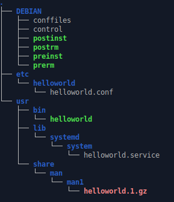

Eine Datei mit der Dateiendung `.deb` ist ein sog. Debianpaket, das man auf allen (auf Debian basierten) Linuxdistributionen findet. Es enthält die für das Ausführen eines Programms notwendigen Binary-Dateien und sonstigen Konfigurationsdateien. Das "Debian Package management tool" `dpkg` ist dazu da um die Debianpakete zu bearbeiten. Optionen sind z.B. `search, install, remove, purge, unpack`.  
`apt` ist das inzwischen gängigere Tool für den selben Zweck auf etwas höherem Niveau, benutzt aber intern auch das `dpkg`.  

Der Vorteil an einem Debianpaket im Vergleich zu den einzelnen Binärdateien ist der, dass der Installations- und Deinstallationsprozess automatisch abläuft.  
In dem Paket stehen alle Informationen, die das Betriebssystem benötigt um zu wissen, was gemacht werden muss.  
Es ist z.B. möglich, dass in dem Paket [Shellscripts](https://devhints.io/bash) enthalten sind, die gewisse Einstellungen am Betriebssystem entweder vor oder auch nach der Installations treffen können.  
Das erhöht die Zahl der möglichen Anwendungsfälle drastisch.  

**Exkurs: [Linux-Dateisystem](https://www.linuxfordevices.com/tutorials/linux/linux-filesystem-heirarchy)**  
Die Navigation in der hierarchischen Dateisystemstruktur beginnt in Linux beim sog. Root-Verzeichnis, also dem Wurzel-Verzeichnis. Man schreibt dafür das Zeichen `/`.  
Alle anderen Verzeichnisse sind diesem Root-Verzeichnis untergeordnet. Vergleichbar ist dies auch mit einem großen Ordner, in dem alle anderen Ordner enthalten sind.  
Einige wichtige Verzeichnisse in `/` sind:  
- **/bin** → Der Ordner, in dem alle Binärdateien liegen, wie z.B. ls oder firefox
- **/boot** → Hier liegen die Dateien des Boot-Loaders
- **/etc** → Hier liegen die meisten Konfigurationsdateien
- **/lib** → Libraries
- **/opt** → Optionale Applikationen und Softwarepakete
- **/home** → Benutzerordner mit allen Dokumenten, Bildern, Videos, ...

Die Struktur eines Debianpakets bildet in gewisser Weise die Struktur des Dateisystems des Betriebssystems ab, nur eben in verkürzter Form.  
Eine ausführbare Binärdatei, die für Gewöhnlich in dem Unterordner `usr/bin/` im Debianpaket liegt, wird nach der Installation entsprechend auch an der Position `/usr/bin/` im Betriebssystem gespeichert.  
Das hat den Grund, dass in Debian-Systemen dieser Ordner bereits in der Umgebungsvariable des Betriebssystems (`echo $PATH`)  gelistet ist und daher alle Dateien, die sich dort befinden, direkt ausgeführt werden können, ohne dass jedes Mal der komplette Speicherpfad angeben werden muss.  
Beispiel mit Angabe des Speicherpfades: `/home/user/Downloads/binary` oder `cd ~/Downloads && ./binary`  
Man könnte natürlich auch den Download-Ordner der Umgebungsvariable manuell hinzufügen(`PATH="$HOME/Downloads:$PATH"`), allerdings ist das meist nicht zu empfehlen.  
Systemdateien und Programme, die mithilfe von `apt` installiert wurden, befinden sich für Gewöhnlich alle im selben Ordner `/usr/bin/`.  

(Manuell installierte Programme aus nicht Debianpaketen und auch eigene selbst compilierte Binärdateien speichert man meist im Ordner `/opt/`, wobei es jedem freigestellt ist, wie man es machen möchte.)  
(Ein Debianpaket ist dabei eigentlich nichts weiter, als eine Standard Archivdatei und sogar mit dem `.ar` Kommandozeilenwerkzeug einsehbar und damit vielleicht vergleichbar mit der häufiger bekannten ZIP-Datei.)  

https://github.com/Tornado3P9/Konsolentools/blob/master/Custom_Debian_Package/make_file_structure.sh  



Das kleinste Debianpaket enthält lediglich den Ordner `DEBIAN` mit der Konfigurationsdatei `control`, in dem die Informationen stehen, die angezeigt werden,  
wenn man das Paket z.B. mit Befehl `apt show debianpaket.deb` aufruft. Eine Beispielausgabe würde wohl Entwicklernamen, Lizenzen, CPU-Architektur oder auch die Programmversion enthalten.  
Neben der Datei `control` befinden sich meist auch noch eine Reihe von Shellscript-Dateien, die die Installation und auch die Deinstallation von dem Programm und dessen Konfiguration regeln.  

In diesem Beispiel sieht man die ausführbare Binärdatei `helloworld`, die sich im Ordner `usr/bin/` befindet. Die meisten Linux-Systeme enthalten das Programm `systemd`, das für die Steuerung von Hintergrundprogrammen ([Daemons](https://de.wikipedia.org/wiki/Daemon "Daemon")) und Bibliotheken zuständig ist. Die Datei `helloworld.service` (optional) enthält Anweisungen darüber, wie systemd das Programm ausführen soll.  
In dem Ordner `man1` befindet sich die "Manpage". Diese Textdatei ist noch einmal komprimiert worden um Speicherplatz zu reduzieren, obwohl das heutzutage eigentlich nicht mehr nötig ist.  
Mit dem Befehl `man helloworld` lässt sich diese im Terminal anzeigen. Allerdings ist in den letzten Jahren ein Downtrend in der Verwendung zu bemerken, da dieses Format oft zu lang und zu unübersichtlich ist und jedes Programm sowieso eine simple Hilfsausgabe enthält: `helloworld --help` oder `helloworld -h`  
Häufiger sieht man derzeit anstatt von `man` auch die Verwendung von dem Tool `tldr` (too long to read). Dieses muss meist nachinstalliert werden, was aber kein Problem darstellt, da es normalerweise in den Paketquellen enthalten ist.  

```bash
#!/bin/bash
# Activate Debugging Settings for better programming
set -uo pipefail
trap 's=$?; echo "$0: Error on line "$LINENO": $BASH_COMMAND"; exit $s' ERR
IFS=$'\n\t'

# # Ensure we are root
# if [[ $EUID -ne 0 ]]; then
#     echo "This script must be run as root" 1>&2
#     exit 1
# fi


# Define some constants
PROGRAM=helloworld
VERSION=1.0
LICENSE=MIT
VENDOR=Vendor_name
ARCHITECTURE=all
CREATOR_NAME=Creator
CREATOR_EMAIL=creator@gmail.com
PRIORITY=optional
DEPENDENCIES=libc6
DESCRIPTION="Best description ever"
DATE=$(date +"%dth %b %Y")
DOCUMENTATION=https://github.com/somewhere
HOMEPAGE=https://homepage.com
FINAL_PROGRAM=helloworld-1.0-all.deb


# Create Example File Structure (only the DEBIAN/ and usr/bin/ folders are absolutely necessary -> that's where the control file and the binary are located)
mkdir -p mydebianpackage/{DEBIAN,etc/${PROGRAM},usr/{bin,lib/systemd/system,share/man/man1}}
# Create Example files ( the binary goes to usr/bin/ )
touch mydebianpackage/{DEBIAN/{conffiles,control,postinst,postrm,preinst,prerm},etc/${PROGRAM}/config.json,usr/lib/systemd/system/${PROGRAM}.service}
# Besides the binary there are also some other files that are supposed to be made executable
chmod +x mydebianpackage/DEBIAN/{postinst,postrm,preinst,prerm}


make_control_file () {
cat <<EOF >> mydebianpackage/DEBIAN/control
Package: $PROGRAM
Version: $VERSION
License: $LICENSE
Vendor: $VENDOR
Architecture: $ARCHITECTURE
Maintainer: $CREATOR_NAME<$CREATOR_EMAIL>
Priority: $PRIORITY
Homepage: $HOMEPAGE
Depends: $DEPENDENCIES
Description: $DESCRIPTION
EOF
}
make_control_file


cat <<EOF >> mydebianpackage/DEBIAN/conffiles
/etc/${PROGRAM}/config.json
EOF

cat <<EOF >> mydebianpackage/DEBIAN/postinst
#!/bin/bash
#...
EOF

cat <<EOF >> mydebianpackage/DEBIAN/postrm
#!/bin/sh

after_remove() {
    :
userdel ${PROGRAM} >/dev/null || true
}

after_purge() {
    :
}

dummy() {
    :
}

if [ "\${1}" = "remove" -o "\${1}" = "abort-install" ]
then
    # "after remove" goes here
    # "abort-install" happens when the pre-installation script failed.
    #   In that case, this script, which should be idemptoent, is run
    #   to ensure a clean roll-back of the installation.
    after_remove
elif [ "\${1}" = "purge" -a -z "\${2}" ]
then
    # like "on remove", but executes after dpkg deletes config files
    # 'apt-get purge' runs 'on remove' section, then this section.
    # There is no equivalent in RPM or ARCH.
    after_purge
elif [ "\${1}" = "upgrade" ]
then
    # This represents the case where the old package's postrm is called after
    # the 'preinst' script is called.
    # We should ignore this and just use 'preinst upgrade' and
    # 'postinst configure'. The newly installed package should do the
    # upgrade, not the uninstalled one, since it can't anticipate what new
    # things it will have to do to upgrade for the new version.
    dummy
elif echo "\${1}" | grep -E -q '(fail|abort)'
then
    echo "Failed to install before the post-removal script was run." >&2
    exit 1
fi
EOF

cat <<EOF >> mydebianpackage/DEBIAN/preinst
#!/bin/sh

before_upgrade() {
    :
}

before_install() {
    :
if ! id ${PROGRAM} &>/dev/null; then
    useradd ${PROGRAM} -s /sbin/nologin -M
fi
}

if [ "\${1}" = "install" -a -z "\${2}" ]
then
    before_install
elif [ "\${1}" = "upgrade" -a -n "\${2}" ]
then
    upgradeFromVersion="\${2}"
    before_upgrade "\${upgradeFromVersion}"
elif [ "\${1}" = "install" -a -n "\${2}" ]
then
    upgradeFromVersion="\${2}"
    # Executed when a package is removed but its config files aren't,
    # and a new version is installed.
    # Looks a _lot_ like an upgrade case, I say we just execute the
    # same "before upgrade" script as in the previous case
    before_upgrade "\${upgradeFromVersion}"
elif echo "\${1}" | grep -E -q '(fail|abort)'
then
    echo "Failed to install before the pre-installation script was run." >&2
    exit 1
fi
EOF

cat <<EOF >> mydebianpackage/DEBIAN/prerm
#!/bin/bash
#...
EOF

# As I don't have got a binary here, let's just make a bash file to have sth to look at:
cat <<EOF >> mydebianpackage/usr/bin/$PROGRAM
#!/bin/bash
echo Hello World
while true; do     sleep 1; done
EOF
chmod +x mydebianpackage/usr/bin/$PROGRAM


# Creating the man page (man program_name)
cat <<EOF >> mydebianpackage/usr/share/man/man1/${PROGRAM}.1
.TH ${PROGRAM} 1 "${DATE}" "${VERSION}" "${PROGRAM} man page"
.SH NAME
${PROGRAM} \- does something
.SH SYNOPSIS
${PROGRAM}, the program returns nothing much right now
.SH OPTIONS
There are no options in the program currently
.SH DESCRIPTION
${PROGRAM} is a simple program
.SH SEE ALSO
puts(3) printf(3)
.SH AUTHOR
$CREATOR_NAME ($CREATOR_EMAIL)
EOF
gzip -9 mydebianpackage/usr/share/man/man1/${PROGRAM}.1


# Creating the systemd service file
cat <<EOF >> mydebianpackage/usr/lib/systemd/system/${PROGRAM}.service
[Unit]
Description=$DESCRIPTION
Documentation=$DOCUMENTATION
ConditionPathExists=/etc/${PROGRAM}/config.json
After=network.target
 
[Service]
ExecStart=/usr/bin/$PROGRAM
Type=simple
User=$PROGRAM
Group=$PROGRAM
Restart=always
RestartSec=10
 
[Install]
WantedBy=multi-user.target
EOF


# Changing content rights to 'root' and also displaying the directory content to the console
change_owner_privileges () {
  sudo chown -R root:root mydebianpackage/
  ls -lR mydebianpackage/
  tree mydebianpackage/
}
change_owner_privileges

# Finally create the debian package!
dpkg-deb --build mydebianpackage/ ${FINAL_PROGRAM}

```

Für weitere Tipps und Hinweise kann man das Analysetool [**lintian**](https://manpages.debian.org/stretch/lintian/lintian.1.en.html) benutzen.
```bash
lintian helloworld-1.0-all.deb
```

## Links
[Debian-file Structure and Layout](https://www.linux.org/threads/debian-file-structure-and-layout.10649/) - linux.org  
[Create a Debian package using dpkg-deb tool](https://blog.knoldus.com/create-a-debian-package-using-dpkg-deb-tool/) - blog.knoldus.com  
[Creating a DEBIAN Package on the Raspberry Pi - Youtube](https://youtu.be/Eu-Tx0zcmLs) - Youtube  
[Building a Simple Deb Package](http://www.hackgnar.com/2016/01/simple-deb-package-creation.html) - hackgnar.com  
[Debian Binary Package Building HOWTO](https://tldp.org/HOWTO/html_single/Debian-Binary-Package-Building-HOWTO/) - tldp.org  
[Three Package Managers - DJ Ware](https://youtu.be/iBVZ2-NIQ6I) - Youtube  
